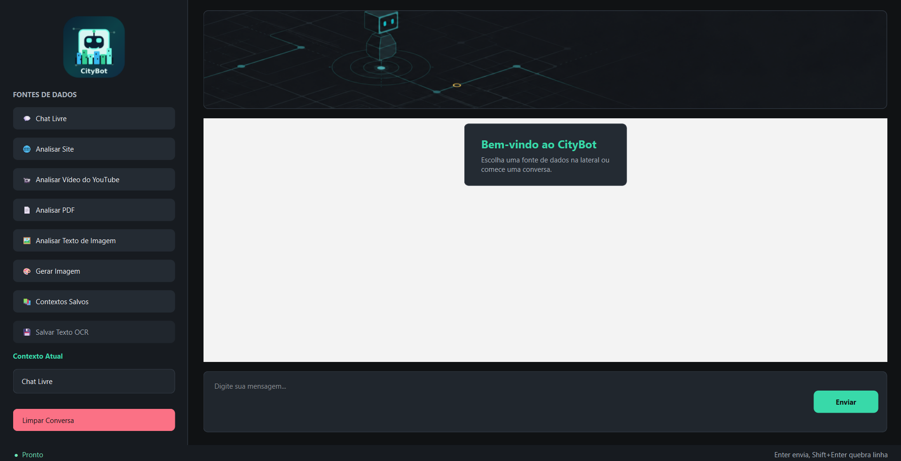

# Felipe Cidade Soares

Estudante de Tecnologias da Informação e Comunicação na UFSC e estagiário na área de dados e tecnologia.

Gosto de transformar problemas pouco estruturados em soluções práticas usando dados, programação e inteligência artificial.

---

## Sobre mim

Estudo Tecnologias da Informação e Comunicação na UFSC e tenho interesse principalmente em análise de dados, BI, machine learning, automação e desenvolvimento de soluções com IA.

Gosto de entender o problema antes de escolher a ferramenta. Em meus projetos, normalmente parto de dados brutos ou de uma necessidade prática, estruturo o processo e tento chegar a algo realmente utilizável, seja um dashboard, um pipeline de machine learning, uma automação ou uma aplicação.

Também desenvolvo trabalhos relacionados à educação, análise de comportamento e uso de dados para apoio à tomada de decisão.

---

## O que faço hoje

* Atuo em estágio na área de dados e tecnologia.
* Trabalho com análise de dados, automação, BI e inteligência artificial.
* Desenvolvo pesquisa aplicada a dados e IA na Educação a Distância.
* Crio projetos com Python, SQL, PostgreSQL e Power BI.
* Exploro machine learning, ETL, APIs e aplicações baseadas em modelos de linguagem.

---

## Tecnologias e ferramentas

Linguagens:

`Python` `SQL` `HTML` `CSS`

Dados e Machine Learning:

`Pandas` `NumPy` `scikit-learn` `Matplotlib` `Plotly` `XGBoost` `LightGBM` `CatBoost`

Banco de dados:

`PostgreSQL` `SQLite` `SQLAlchemy`

BI e análise:

`Power BI` `Jupyter Notebook`

IA e aplicações:

`LangChain` `FAISS` `Groq` `Google Gemini` `Azure OpenAI`

Ferramentas:

`Git` `GitHub` `VSCode` `pgAdmin` `OpenAI Codex` `Antigravity`

  
  
  
  
  
  
  
  
  
  

---

## Projetos

<strong>Um portfólio com cara de laboratório aplicado.</strong> 
Apps, pipelines e dashboards que começam em dados brutos e terminam em decisão, automação ou leitura executiva.

 

| Começo | Transformo | Entrego |
|---|---|---|
| Dados públicos, arquivos, páginas, vídeos, imagens e bases de comportamento | ETL, limpeza, modelagem, métricas, OCR, LLMs e visualização | Dashboards, assistentes, análises executivas e histórias de dados prontas para uso |

### Vitrine principal

<table>
  <tr>
    <td width="50%" valign="top">
      
      <h3>CityBot</h3>
      
<strong>Um assistente que transforma fontes soltas em conversa útil.</strong>

      
PDFs, páginas da web, vídeos do YouTube, imagens e chat livre entram no mesmo fluxo. O sistema lê, extrai, conversa, salva contexto e mantém histórico em SQLite.

      
<strong>Por baixo:</strong> PySide6, CLI, Gemini, Azure OpenAI, OCR com OpenCV e Tesseract, scraping, leitura de PDF e fallback de transcrição local com faster-whisper ou WhisperX.

      
<code>Python</code> <code>PySide6</code> <code>SQLite</code> <code>OCR</code> <code>LLMs</code>

      
<a href="https://github.com/cidade-felipe/citybot"><strong>Abrir repositório</strong></a>

    </td>
    <td width="50%" valign="top">
      
      <h3>Ecommerce Shipping Performance Dashboard</h3>
      
<strong>Quando logística vira resultado de negócio.</strong>

      
Um dashboard executivo que conecta GMV, pedidos, ticket médio, atraso, SLA, satisfação do cliente e desempenho regional usando dados públicos da Olist.

      
<strong>Por baixo:</strong> modelagem em esquema estrela, tabela calendário, DAX, time intelligence, análise MoM/YoY e storytelling orientado a decisão.

      
<code>Power BI</code> <code>DAX</code> <code>Modelagem de Dados</code> <code>BI</code>

      
<a href="https://github.com/cidade-felipe/ecommerce-shipping-performance-dashboard"><strong>Abrir repositório</strong></a>

    </td>
  </tr>
  <tr>
    <td width="50%" valign="top">
      
      <h3>Acidentes em Rodovias Federais no Brasil</h3>
      
<strong>Um mapa analítico da segurança viária brasileira.</strong>

      
Dados da PRF e referências geográficas do IBGE viram uma série histórica de 2017 a 2025 para investigar padrões temporais, territoriais e demográficos dos sinistros.

      
<strong>Por baixo:</strong> consolidação anual, correção de encoding, padronização de municípios, fuzzy matching, engenharia de atributos e preparação para Power BI.

      
<code>Python</code> <code>Pandas</code> <code>NumPy</code> <code>ETL</code> <code>Power BI</code>

      
<a href="https://github.com/cidade-felipe/Acidentes-rodovias-federais-Brasil"><strong>Abrir repositório</strong></a>

    </td>
    <td width="50%" valign="top">
      
      <h3>Mental Health: Burnout in Tech Workers</h3>
      
<strong>Burnout tratado como leitura de gestão, suporte e retenção.</strong>

      
Uma análise de 100 mil registros sobre saúde mental em tecnologia, cruzando burnout, estresse, ansiedade, depressão, carga de trabalho, senioridade, modelo de trabalho e intenção de troca.

      
<strong>Por baixo:</strong> preparação em Python, análise exploratória, métricas executivas e dashboard Power BI com cuidado explícito para interpretar associação sem afirmar causalidade.

      
<code>Python</code> <code>Pandas</code> <code>Plotly</code> <code>Power BI</code>

      
<a href="https://github.com/cidade-felipe/Mental-Health-Burnout-in-Tech-Workers"><strong>Abrir repositório</strong></a>

    </td>
  </tr>
</table>

### Investigações de dados

<table>
  <tr>
    <td width="50%" valign="top">
      
      <h3>Gaming and Mental Health Analysis</h3>
      
<strong>Hábitos de jogo colocados lado a lado com rotina, saúde mental e produtividade.</strong>

      
A análise conecta tempo de jogo, severidade de dependência, sono, ansiedade, absenteísmo, prazos perdidos, produtividade e churn.

      
<strong>Por baixo:</strong> tratamento de uma base com 250 jogadores, normalização de categorias, tradução para português, ID rastreável, Plotly e Power BI.

      
<code>Python</code> <code>Pandas</code> <code>Plotly</code> <code>Power BI</code>

      
<a href="https://github.com/cidade-felipe/gaming-and-mental-health-analysis"><strong>Abrir repositório</strong></a>

    </td>
    <td width="50%" valign="top">
      
      <h3>Flavors of Cacao 2006-2024</h3>
      
<strong>Chocolate analisado como dado: origem, teor, fabricante e qualidade.</strong>

      
Mais de 2.790 avaliações viram uma leitura sobre barras premium, teor de cacau, países de origem e padrões de excelência no mercado de chocolates finos.

      
<strong>Por baixo:</strong> KaggleHub, Pandas, tradução automática de países, padronização de decimais e dashboard Power BI com storytelling sensorial.

      
<code>Python</code> <code>Pandas</code> <code>KaggleHub</code> <code>Power BI</code>

      
<a href="https://github.com/cidade-felipe/Flavors-of-Cacao-2006-2024"><strong>Abrir repositório</strong></a>

    </td>
  </tr>
  <tr>
    <td colspan="2" valign="top">
      <h3>Prouni Data Insights</h3>
      
<strong>Educação superior vista por acesso, território e perfil demográfico.</strong>

      
Dados do Prouni entre 2005 e 2019 são organizados em uma leitura visual sobre bolsas integrais e parciais, gênero, raça, modalidade de ensino, região e estado.

      
<strong>Por baixo:</strong> preparação em Python, notebooks de análise, Power BI e GeoJSON para mapa por UF.

      
<code>Python</code> <code>Pandas</code> <code>Power BI</code> <code>GeoJSON</code>

      
<a href="https://github.com/cidade-felipe/Prouni-Data-Insights"><strong>Abrir repositório</strong></a>

    </td>
  </tr>
</table>

---

## Em que estou me aprofundando

* Análise de dados e Business Intelligence
* APIs com FastAPI
* Machine Learning aplicado à educação
* Explicabilidade de modelos (XAI)
* Pipelines ETL e automação
* Integração de aplicações com modelos de linguagem

---

## Estatísticas

  
  &nbsp;&nbsp;
  

---

Curiosidade faz as perguntas. Código tenta responder, e a resposta melhora durante o processo.
